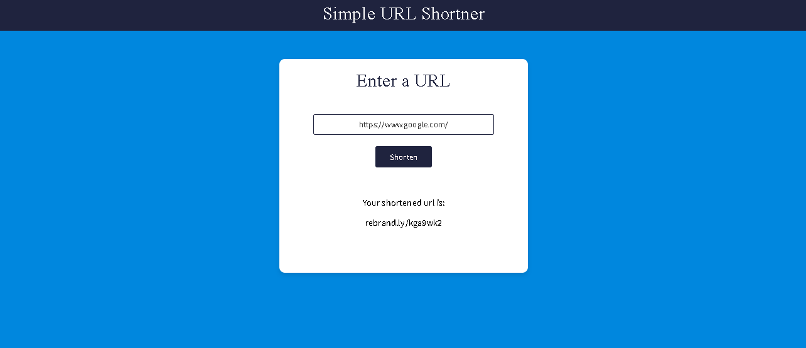

# URL Shortener

## Overview

This project is a simple URL shortener application that utilizes the Rebrandly API to convert long URLs into short, manageable links. The application is built using HTML, CSS, and JavaScript, and demonstrates how to make AJAX requests to an external API.



## Features

- Input field for entering the URL to be shortened.
- Button to trigger the URL shortening process.
- Display area for showing the shortened URL.

## Technologies Used

- **HTML**: Provides the structure of the webpage.
- **CSS**: Styles the page for a clean and user-friendly interface.
- **JavaScript**: Handles the functionality of URL shortening and API interactions.
- **Rebrandly API**: Used for generating shortened URLs.

## Setup

1. **Clone the repository**:

   ```bash
   git clone https://github.com/yourusername/url-shortener.git
2. Navigate to the project directory:

    ```bash
    cd url-shortener
3. Open index.html in your web browser to view the application.

## How It Works
- Enter a long URL into the input field.
- Click the "Shorten" button.
- The application sends a request to the Rebrandly API with the URL to be shortened.
- The API responds with the shortened URL, which is then displayed on the page.

## API Configuration
Make sure to replace the apiKey value in script.js with your own Rebrandly API key to enable the URL shortening functionality.
 
```bash const apiKey = 'your-api-key-here';```


##  Code Explanation
HTML: Provides the structure for the input field, button, and response display area.
CSS: Styles the layout and elements to ensure a good user experience.
JavaScript: Contains functions for handling the API request and updating the UI.

## script.js
`shortenUrl()`: Handles making a POST request to the Rebrandly API and processing the response.

`displayShortUrl(event)`: Clears the current display and initiates the URL shortening process.

## Contributing
Feel free to fork this repository and submit pull requests. For significant changes, please open an issue to discuss before making modifications.